---
aliases:
- Language
- Languages
- Language Group

todo: The language map looks kinda stupid, maybe redo it later
---
## Languages & Groups
```dataview
TABLE WITHOUT ID
file.link AS "Language/Group",
choice(language_group = null, "**Group**", "Language") AS "Type",
regions AS "Regions",
default(language_group, file.name) AS "Group"
FROM (#language AND -#Dead) OR #Language_Group
SORT (default(language_group, file.name)+choice(language_group = null, "Group", "Language")) ASC
```
## Language Map

```mermaid
flowchart TD
	subgraph Coaq
		Soldovin{Soldovin}
		
		Aquan[Aquan]
		AquanChild[Aquan Child]
		
		Korinari[Korinari]
		
		Aquan --> AquanChild
		AquanChild -.-> Korinari
		AquanChild -.-> Soldovin
	end
	subgraph Wandering[Wandering Languages]
		Thuma[Thüma]
	end
	
	Wandering -.-> Korinari
	
	subgraph Khra
		Kharinthi[Kharinthi]
		ProtoKhra[Proto-Khra]
		
		ProtoKhra --> Kharinthi
	end
	
	Khra -.-> Wandering
	
	subgraph Avi Languages
		Avi[Avi]
		OldAvi[Old Avi]
		
		OldAvi --> Avi
	end
	
	OldAvi --> ProtoKhra
	
	subgraph Proto[Proto Languages]
		ProtoBellerosElisiparian[Proto-Belleros-Elisiparian]
		ProtoNaiwa[Proto-Naiwa]
		Belleros1[Belleros Unnamed]
		Island1[Island Unnamed]
		
		ProtoBellerosElisiparian --> ProtoNaiwa
		ProtoBellerosElisiparian --> Belleros1
		Belleros1 --> Island1
	end
	
	ProtoBellerosElisiparian --> OldAvi
	ProtoNaiwa --> Thuma
	
	subgraph Taundor
		Taundorian[Taundorian]
		OldTaundorian[Old Taundorian]
		NewTaundorian[New Taundorian]
		SiarTaundorian[Siar Taundorian]
		
		Taundorian --> OldTaundorian
		Taundorian --> NewTaundorian
		Taundorian --> SiarTaundorian
	end
	
	Island1 --> Taundorian
	
	subgraph International
		Naiwa[Naiwa]
	end
	
	ProtoNaiwa --> Naiwa
```

